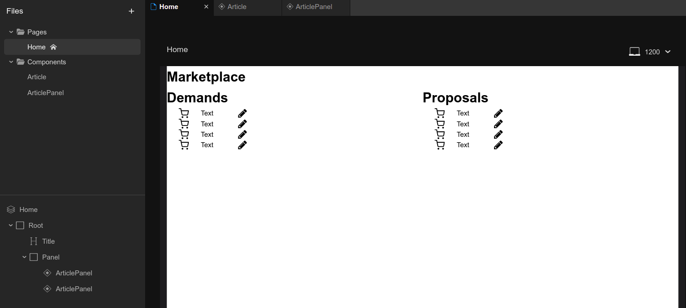

# 202105-otuskotlin-marketplace

Учебный проект
курса [Kotlin Backend Developer](https://otus.ru/lessons/kotlin/?int_source=courses_catalog&int_term=programming).
Marketplace -- это площадка, на которой пользователи выставляют предложения и потребности. Задача площадки --
предоставить наиболее подходящие варианты в обоих случаях: для предложения -- набор вариантов с потребностями, для
потребностей -- набор вариантов с предложениями.

## Учебный маркетинг приложения

Считаем, что целевая аудитория учебного сервиса -- это средние и крупные предприятия, желающие (а) продать свою
высокотехнологичную продукцию или (б) найти поставщиков для ее производства.

### Гипотетический портрет пользователя для службы Потребностей

1. Высококвалифицированный инженер среднего или высшего звена, который ищет поставщиков компонентов для разрабатываемого
   продукта.
1. Мужчина от 30 до 50 лет
1. С высшим образованием
1. С критическим складом ума, со склонностью сопоставлять цифры, технические характеристики и не ведется на броскую
   рекламу
1. Как правило женат, имеет детей (как маленьких, так и взрослых), обеспечен, имеет жилье и автомобиль

### Гипотетический портрет пользователя для службы Предложений

Можно выделить несколько сегментов пользователей

1. Высококвалифицированный и опытный сотрудник отдела продаж, знающий как продукт, так и технические детали
    1. Мужчина от 30 до 50 лет
    1. С высшим образованием, знает технологические нюансы продаваемой продукции и как эта продукция используется
    1. Знаком лично с большинством клиентов, большая часть всех продаж через личные контакты
1. Начинающий или низкоквалифицированный продажник
    1. Молодой мужчина до 30-35 лет
    1. Без высшего образование или без опыта работы в соответствующей отрасли
    1. Делает продажи посредством холодных звонков
    1. и т.д.
1. И т.д.

## Описание MVP

### Функции (эндпониты)

1. CRUDS (create, read, update, delete, search) для объявлений (ad)
1. ad.offers (опционально)

### Описание сущности ad

1. Info
    1. Title
    1. Description
    1. Owner
    1. Visibility
1. DealSide: Demand/Proposal
1. ProductType (гаечный ключ, ...)
1. IPropertyValues - интерфейс, описывающий различные реализации продуктов
    1. Болты - учебный пример
        1. Длина
        1. Толщина
        1. Резьба
        1. Форма

# Структура проекта

## Подпроекты для занятий по языку Kotlin

1. [ok-m1l1](ok-m1l1) - Вводное занятие, создание первой программы на Kotlin
1. [ok-m1l3-oop](ok-m1l3-oop) - Объектно-ориентированное программирование
1. [ok-m1l4](ok-m1l4) - Предментно ориентированные языки (DSL)
1. [ok-m1l5](ok-m1l5) - Асинхронное и многопоточное программирование с корутинами
1. [ok-m1l6-flows-and-channels](ok-m1l6-flows-and-channels) - Асинхронное и многопоточное программирование с каналами
1. [ok-m1l7-kmp](ok-m1l7-kmp) - Kotlin Multiplatform и интероперабельность с JVM, JS
1. [ok-m2l2-testing](ok-m2l2-testing) - Тестирование проекта, TDD, MDD

## Транспортные модели, API

1. [specs](specs) - описание API в форме OpenAPI-спецификаций
1. [ok-marketplace-be-transport-openapi](ok-marketplace-be-transport-openapi) - подпроект для генерации транспортных
   моделей для бэкенда из спецификаций OpenAPI
1. [ok-marketplace-be-transport-mapping-openapi](ok-marketplace-be-transport-mapping-openapi) - мапинг OpenAPI
   транспортных моделей во внутренние модели
1. [ok-marketplace-mp-transport-mp](ok-marketplace-mp-transport-mp) - подпроект с транспортными моделями на Kotlin
   Multiplatform
1. [ok-marketplace-be-transport-mapping-openapi](ok-marketplace-be-transport-mapping-openapi) - мапинг KMP транспортных
   моделей во тренние модели

## Фреймворки и транспорты

1. [ok-marketplace-be-app-spring](ok-marketplace-be-app-spring) - Приложение на Spring Framework
1. [ok-marketplace-be-app-ktor](ok-marketplace-be-app-ktor) - Приложение на Ktor
1. [ok-marketplace-be-app-serverless](ok-marketplace-be-app-serverless) - Бессерверное приложение для AWS

## Модули бизнес-логики

## Хранение, репозитории, базы данных
